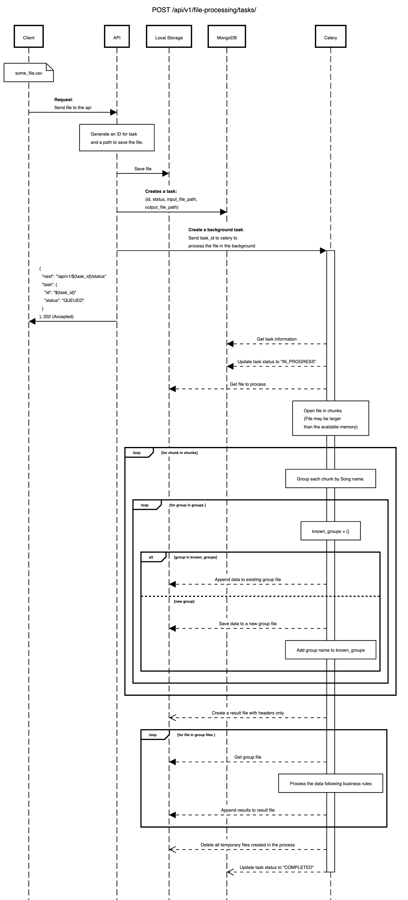

# CSV Processing API
This API processes CSV files to generate an output CSV file that contains the Total Number of Plays for Date for each song and date combination.

# Contents

- [Made With](#made-with)
- [Architecture](#architecture-overview)
- [Installation](#installation)
- [Usage](#usage)
- [Findings & Decisions](#findings--decisions)
- [Tests](#tests)
- [TODOs](#todos)


## Made With
- Python
- Flask
- Pandas
- Polars
- Celery
- MongoDB
- RabbitMQ

## Architecture Overview

The architecture of this API is designed to handle large CSV files and perform asynchronous processing,
considering that the uploaded and result files may exceed the server's available memory.

_**Important:** Did not spend much time on configuration of componentes other than the flask application and the celery worker, all other components are just a "plug and play" docker-compose version with basic to none security at all. This is not intended to be production ready (despite the python code) environment._

### Components
- **Flask API**: The web server for the API.
- **Local Storage**: Storage within the web server.
- **MongoDB**: Database for storing information about tasks.
- **RabbitMQ**: Message broker enabling async communication between Celery and Flask.
- **Celery Worker**: Processes files asynchronously.
- **Celery Beat**: Schedules a task every 30 seconds to clean up files in local storage.

### Sequence Diagram of the relevant endpoint


**NOTE:** The process of saving/appending each group data to a group file,
and appending the results from each group file to the result file are made using multithreading,
so they are not strictly a for loop which processes one item at a time.

## Installation
### Requirements
- [Docker](https://docs.docker.com/get-docker/)
- [docker-compose](https://docs.docker.com/compose/install/)
- `.env`: The application relies on environment variables (refer to `.env.example` for reference).
Create a copy named `.env` and modify the values as needed. _It will
work if you use the values in the `.env.example` file but is not recomended._

### Run
1. Navigate to the project folder directory.
2. Execute the command:
```bash
docker-compose up --build
```

## Usage
_You can try the whole API workflow within the swagger UI._

The API documentation, including the Swagger UI, can be accessed at:
> http://127.0.0.1:5002/api/v1/docs/swagger


## Findings & Decisions
Processing larger datasets can be challenging and understanding the frameworks that "solve" this problem can be even more.
My first approach would be to stream open the file using python's built-in `csv` module, but this could be overwhelming since
this would lead to a lot of python code to manipulate the data, generating chunks of lines and so on.

By searching for a framework that could also address this problem, you will find `pandas`, `polars`, `Dask`
, `DuckDB`, `Vaex`, etc. I tried a few of these to came up with this solution.

My first try was `pandas`, but I run into the `pandas` main issue fairly quick, which is the memory.
`pandas` need to have the whole dataframe in the memory to process it
(of course you can open the file in chunks and then do the processing with chunks,
but since I had to calculate all the times played for each song/date combination,
this would require a different approach), and also `pandas` is single threaded, meaning that it
cannot leverage multiple cores in a machine or cluster.

`Dask` was my second try since it has the ability to work in a distributed environment and use the
_lazy_ approach to dataframes where all the computing are done lazily, only when the results are
actually required. This allows the framework to create a computing graph with the tasks that it
needs to perform and optimize those graphs to have a better performance. The problem with `dask`
is that it was built on top of `pandas`, even though it is considerably faster than `pandas`
(due to its distributed approach and the "try" to use multiple threads since a `dask` dataframe
is made of multiple smalled `pandas` dataframes, so the framework tries to do some multi-threading.)
One of the requirements of this project is that the **input** and the **output** files may be
larger than memory, the problem wasn't the input file, because `dask` do not load the entire
file in the memory at once (like `pandas`) due to its lazy evaluation. The problem started when
trying to save the results to a new `.csv` file, `dask` will need to `compute()` to execute the
computation graphs and gather the results. By calling `compute()` the result dataframe will be loaded
entirely into memory and that may raise Out Of Memory error. `dask` actually have a solution for this,
it involves distributed computing relying on multiple machines running in a cluster (Too much for us right now).

My last resort was `polars`. Yes, it is indeed "blazing fast" like the docs says. `polars` was built
from the ground up using `Rust` so it's multithreaded by default and also apply lazy evaluation on
the dataset. So it also will create computational graphs first, optimize as much as possible the graphs
and only evaluate the results once required. `Polars` could solve the problem with just about less than
10 lines of code **IF** we were not working with `.csv` files. `polars` has a method that can save the results
to `parquet` or `Feather` formats in the disk even if the results are larger than the memory, those methods
relly on streaming the results to a file and I tested it with 10+Gb files on containers limited
to 1Gb of memory, never run into any issue. Since the requirement is that the end user will have access
to a `.csv` file, could not use that approach.

Here is the final decision, the same old thing talked for a long time to everyone:
> "Split the big problem into smaller and more manageble problems"

This is what I came up with:
1. **Open the `.csv` file in chunks using `pandas`:** by doing that, we do not have to care about the
total file size. `polars` have a similar API called `read_csv_batched()` but in my tests, `pandas` did a better job on chunking files since the `polars` method is not lazy evaluated.
2. **Convert each `pandas` chunk dataframe into `polars` dataframe:** As mentioned before, `polars` is significantly faster than `pandas` on processing data, so we will use that in our favour.
3. **Partitioning the chunk:** `polars` has a `partition_by` method were it can group data into
partitions, so we partitioned the chunk using the song name, each partition will contain the only one song and the other information of that song like "Date" and "Number of Plays".
4. **Save/Append each partition data:** With the partitions containing only information about one song each,
now we can save it into a new `.csv` file, or append to an existing file related to that song (a variable containing the `seen_groups` is initialized in the beggining of this process to control wheter the file for the group already exists)
5. **Create a result file empty and add the headers `Song,Date,Total Number of Plays for Date`**.
6. **Process all the smaller files**: All the smaller file would be saved into a directory named after the `task_id`,
by going into that directory, we process each file by loading it lazily with `polars`, doing the grouping
by "Song" and "Date", and summing the "Number Of Plays". With that we will have a dataframe with just one row
for each song/date combination, so we can append it to the result file.

With this approach we won't have problem regarding the file sizes and memory. The bottleneck here is the
smaller temporary files for the songs, if those files are larger than memory, we would have a problem. To improve that capacity,
we could partition the chunks not only by song, but by song/date combination, which would result in even smaller
files. The problem with this is the overhead of having a very large number of files that needs to be opened and appended.(I tested this as well
, and it has a massive impact in the overall performance, it does the job, but for the file, it went
from 53 seconds to 376 seconds of processing time).

For even worst cases, I think solution like `dask` or `spark` would be better due to the whole clustering thing.
We are not talking here about processing thousands of huge files in only one computer,
that would be insane.

### Time complexity (big O notation)
Regarding time complexity, it is realy hard to estimate it when you are using some external library
(did not have the time to go thorugh the entire codebase of each library used here). So just for sake of
rught estimation we can make some guesses:
1. If we assume that the number of unique songs (K) is much smaller than the number of rows in the
CSV file (N), and the average size of each partition (P) and the average size of the result data (R)
are not significantly large, we can drop those terms. This assumption is based on the observation
that typically the number of unique songs is much smaller compared to the total number of rows in a large dataset.

2. Since we are working with chunks of the CSV file, the size of each chunk (M) can be considered a
constant or a small factor compared to the overall size of the file. Therefore, we can also drop this term.

3. We are left with O(N + K) as the dominant terms.

Just for clarity, the time complexity will relly on the total number of rows and the total
number of unique songs, so the time to process a file will be impacted the most by these two variables.


## Tests
The main application container and the Celery worker are configured with 1GB of RAM. You can use
the `script.py` provided in the `tests/` folder to create large CSV files for testing.
The output file will be saved in `/tests/static/`. Feel free to test the application with files
larger than 1GB to ensure smooth operation.

## TODOs

- Expand test coverage: I have wroted just a small amount of tests due to time constraints.
- Improve API documentation.
- Enhance components configuration (e.g. mongo, rabbitmq, celery).
- Enhance logging capabilities.
